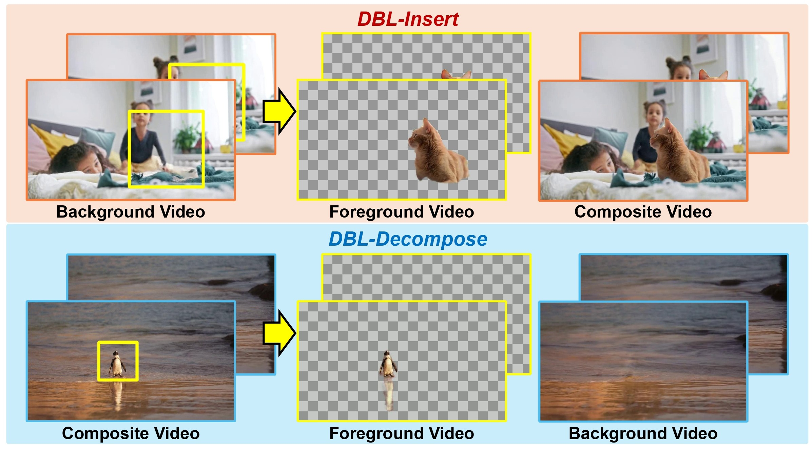
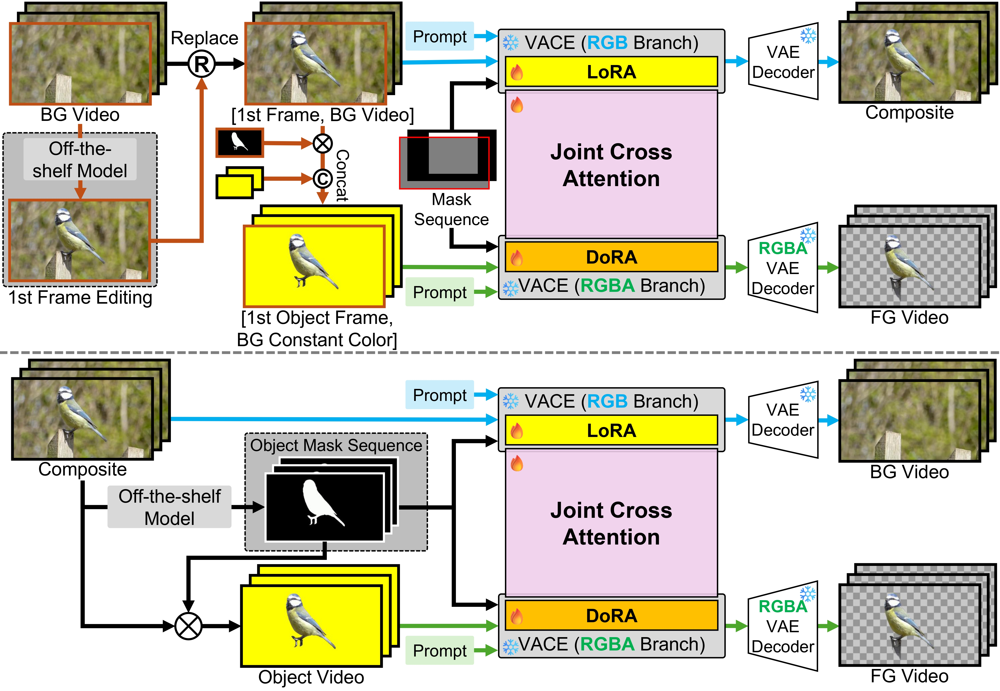
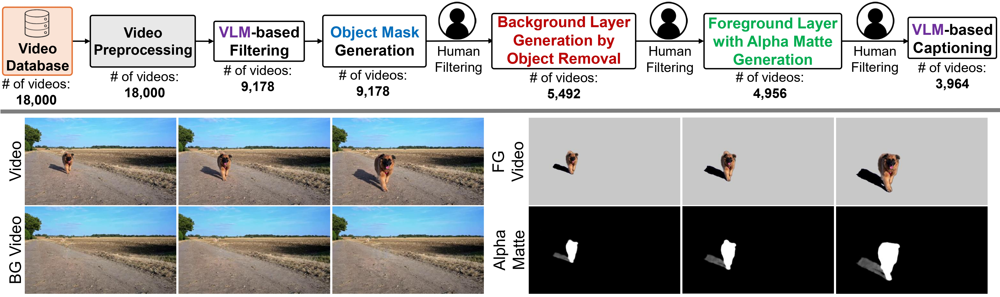
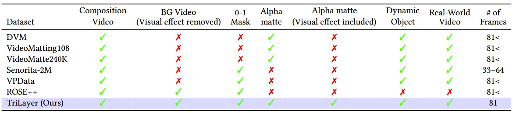

# DBL-Diffusion: Explicit Layer Modeling for Video Object Insertion and Layer Decomposition🔥
  
  

<p align="center">
    <a href=""></a>
    <a href="https://kyujinhan.github.io/dbl-diffusion.github.io/"></a>
    <a href=""></a>
</p>

**We will publicly release the code, dataset, and pretrained models upon paper acceptance.🤗**

# Table of Contents📖
1. [Introduction📖]()
2. [TriLayer Datasets📚]()
3. [Training🤗]()
4. [Inference🌊]()
5. [ComfyUI🌠]()
6. [References]()


# Introduction📖
|  | 
|:--:| 
| *Overall pipeline of DBL-Diffusion. Above is DBL-Insert, and bleow is DBL-Decompose.* |

Most video editing systems still lack explicit layered video representations, limiting their ability to perform realistic compositing, object reuse, and consistent manipulation. This limitation is especially pronounced in video object insertion and video layer decomposition, where existing methods rely on implicit inference or per-scene optimization due to the absence of explicit foreground-layer supervision. We introduce **TriLayer**, a large-scale triplet video dataset containing aligned composite, background, and foreground videos, where the foreground layers include both object appearance and associated visual effects. This explicit supervision enables models to learn layered video representations directly rather than inferring them implicitly. Building on this dataset, we propose **DBL-Diffusion**, a dual-branch diffusion framework that jointly models RGB composites and RGBA foreground layers through shared denoising and cross-branch interaction. We instantiate the framework in two tasks: **DBL-Insert** for layered object insertion, which generates explicit RGBA layers for realistic compositing and flexible post-editing, and **DBL-Decompose** for video layer decomposition, which recovers foreground and background layers using triplet supervision. Experiments demonstrate that explicit layer modeling substantially improves both insertion fidelity and decomposition quality.

# TriLayer Dataset📚
   
   
To support learning layered representations that capture both object appearance and object-induced visual effects, **TriLayer** provides aligned composite, background, and foreground videos for each sample. The composite video contains the original scene with the object present. The foreground video and its alpha matte capture both opaque object regions and semi-transparent effects such as shadows and reflections. The background video contains neither the object nor its associated effects, serving as a clean reference for decomposition and as the input for layered object insertion. Although each sample contains three aligned videos, these are not independent layers; the composite is physically formed by alpha-compositing the foreground layer onto the background. Each sample additionally provides the object name and a VLM-generated caption describing its appearance and associated effects, which serve as conditioning signals for both **DBL-Insert** and **DBL-Decompose**. The dataset contains 3,964 video triplets spanning diverse objects, motions, environments, and lighting conditions.

(To be continue...)


# Training🤗
```python
(To be continue...)
```

# Inference🌊
```python
(To be continue...)
```

# ComfyUI🌠
  
(To be continue)

# BibTex
```
@article{han2026explicitlayer,
  author    = {Han, kyujin and Shin, seungjoo and Cho, sunghyun},
  title     = {Explicit Layer Modeling for Video Object Insertion and Layer Decomposition},
  journal   = {arxiv},
  year      = {2026},
}
```
