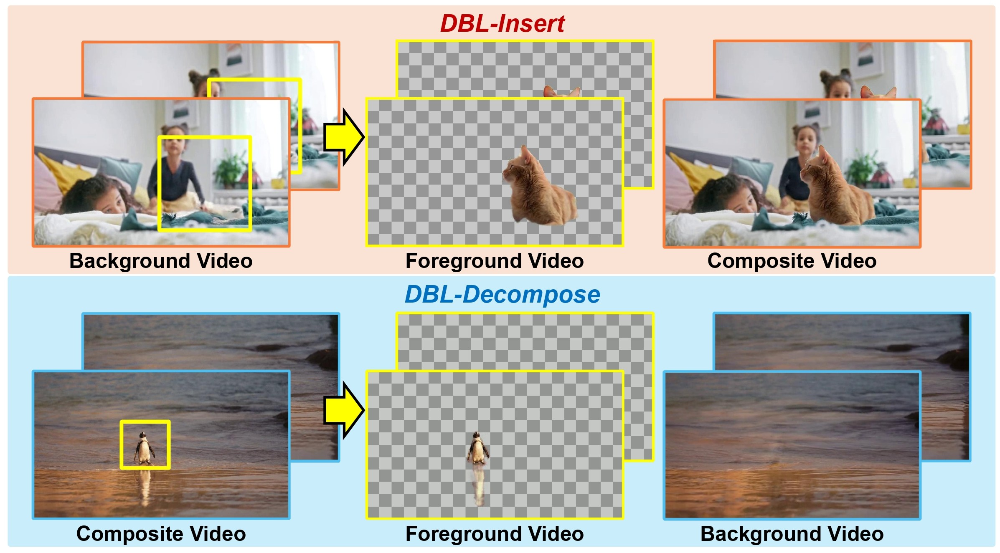
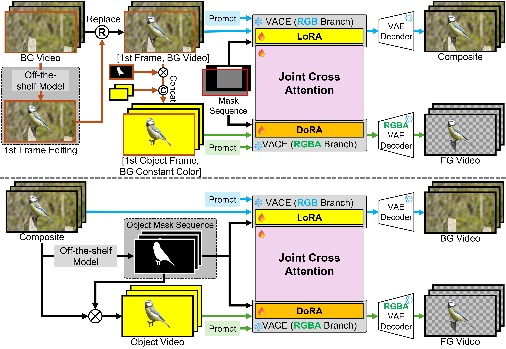
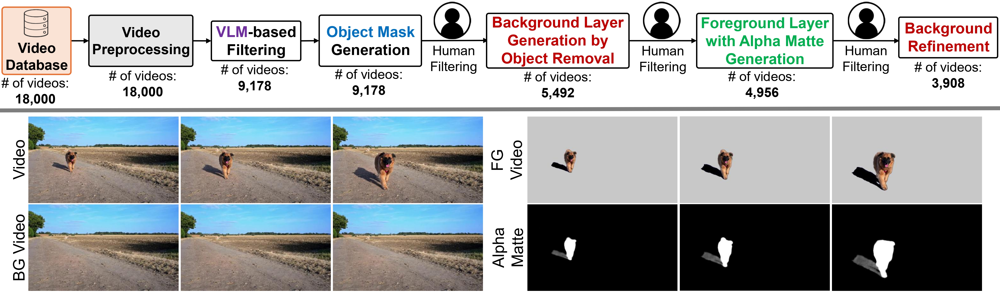
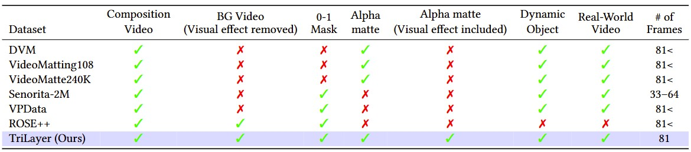
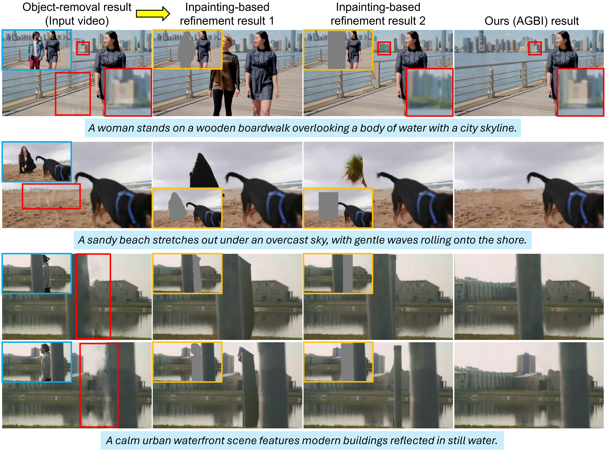
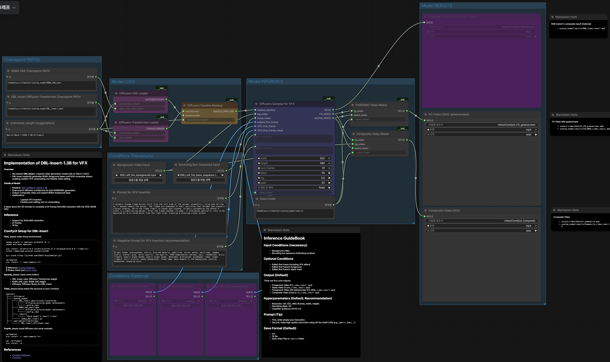

# DBL-Diffusion: Explicit Layer Modeling for Video Object Insertion and Video Layer Decomposition🔥
  
  

<p align="center">
    <a href="https://arxiv.org/pdf/2607.25802"></a>
   <a href="https://kyujinhan.github.io/dual-branch-layered-diffusion/"></a>
    <a href="https://huggingface.co/datasets/kyujinpy/TriLayer-RGBA"></a>
</p>

**🤗We will publicly release the code, dataset, and pretrained models upon paper acceptance.🤗**  


# News
**[2026. 07. 26.] - Release the [paper](http://arxiv.org/abs/2607.25802) on arXiv! Check out DBL-Diffusion’s amazing layered video generation capabilities🔥🔥**

# Table of Contents📖
1. [Introduction📖](https://github.com/KyujinHan/DBL-Diffusion#introduction)
2. [TriLayer Datasets📚](https://github.com/KyujinHan/DBL-Diffusion#trilayer-dataset)
3. [Training🤗](https://github.com/KyujinHan/DBL-Diffusion#training)
4. [Inference🌊](https://github.com/KyujinHan/DBL-Diffusion#inference)
5. [ComfyUI🌠](https://github.com/KyujinHan/DBL-Diffusion#comfyui)
6. [BibTex](https://github.com/KyujinHan/DBL-Diffusion#comfyui)
  

# Introduction📖
|  | 
|:--:| 
| *Overall pipeline of DBL-Diffusion. Top is DBL-Insert, and bottom is DBL-Decompose.* |

Most video editing systems still lack explicit layered video representations, limiting realistic compositing, object reuse, and consistent manipulation.
This limitation is particularly evident in video object insertion and video layer decomposition, where existing methods lack direct supervision for foreground layers that capture both objects and their associated visual effects.
  
We introduce **🔥TriLayer🔥**, a triplet video dataset containing aligned composite--background--foreground videos, where the foreground layers include both object appearance and associated visual effects. 
With aligned triplet supervision, **TriLayer** enables explicit supervised learning of layered video representations for the first time.
Building on this dataset, we propose **🔥DBL-Diffusion🔥**, a dual-branch diffusion framework that jointly models scene-level RGB content and RGBA foreground layers through cross-branch interaction during denoising.
We instantiate the framework in two tasks: **⭐DBL-Insert⭐** for layered object insertion, which generates explicit RGBA layers for realistic compositing and flexible post-editing, and **⭐DBL-Decompose⭐** for video layer decomposition, which recovers foreground and background layers using triplet supervision. 
Experiments demonstrate that explicit layer modeling substantially improves both insertion fidelity and decomposition quality.

# TriLayer Dataset📚
   
   
To support learning layered representations that capture both object appearance and object-induced visual effects, **🔥TriLayer🔥** provides aligned composite, background, and foreground videos for each sample. The composite video contains the original scene with the object present. The foreground video and its alpha matte capture both opaque object regions and semi-transparent effects such as shadows and reflections. The background video contains neither the object nor its associated effects, serving as a clean reference for decomposition and as the input for layered object insertion. Although each sample contains three aligned videos, these are not independent layers; the composite is physically formed by alpha-compositing the foreground layer onto the background. Each sample additionally provides the object name and a VLM-generated caption describing its appearance and associated effects, which serve as conditioning signals for both **DBL-Insert** and **DBL-Decompose**. The dataset contains 3,908 video triplets spanning diverse objects, motions, environments, and lighting conditions.
  
```python
(To be continue...)
```  
  
## Background refinement
|  | 
|:--:| 
| *Comparison of background refinement with inpainting-based results (Figure S25 in the paper).* |

Existing video object removal methods can remove the target object and their visual effects, but often leave residual artifacts (e.g., afterimage and ghosting) in the reconstructed background.   
To this end, we propose the **✨Appearance-Guided Background Inpainting (AGBI)✨** for refining residual artifacts in object-removed backgrounds with appearance guidance from the source video.

```python
(To be continue...)
```  
> ✨Code reference: [Training-free video editing](https://github.com/KyujinHan/Awesome-Training-Free-WAN2.1-Editing). 
  
# Training🤗
## DBL-Insert🤖
```python
(To be continue...)
```

## DBL-Decompose🤖
```python
(To be continue...)
```

# Inference🌊
## DBL-Insert🤖
```python
(To be continue...)
```

## DBL-Decompose🤖
```python
(To be continue...)
```

# ComfyUI Guideline🌠
  
(To be continue...)

# TO-DO list
- [ ] Release demo video
- [ ] Release inference code and weights
- [ ] Release dataset
- [ ] Release training code
- [ ] Release ComfyUI

# BibTex
```
@article{han2026explicitlayer,
  author    = {Han, kyujin and Shin, seungjoo and Cho, sunghyun},
  title     = {Explicit Layer Modeling for Video Object Insertion and Video Layer Decomposition},
  journal   = {arxiv},
  year      = {2026},
}
```
